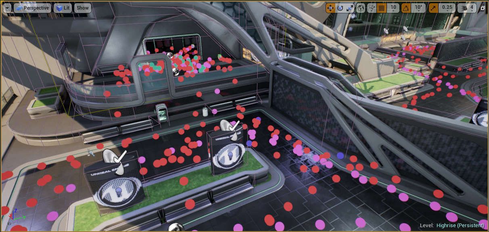
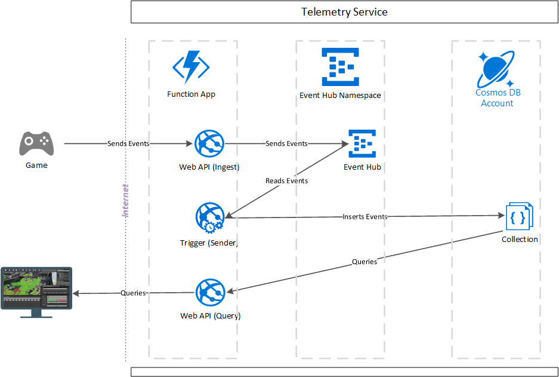
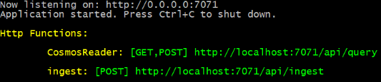

<link rel="stylesheet" type="text/css" media="all" href="Documentation/style/styles.css" />

# Introduction 
This is an example of how a developer could implement an in-editor telemetry visualization solution for their game.  In fact, we developed an Unreal Engine 4 [Plugin](https://aka.ms/UE4TelemetryPlugin) using this sample as its backend. While our plugin is made for [Unreal Engine 4](https://www.unrealengine.com/en-US/what-is-unreal-engine-4), the service component is game engine agnostic.



It utilizes **Azure Functions** to implement an API to ingest, process, and query the telemetry.  **Azure Event Hub** buffers the incoming telemetry before it is finally stored in **Azure Cosmos DB**.



# Getting Started
1.	Installation process

The service components can be deployed to Azure using the Azure Resource Manager (**ARM**) template.  It will
1. Create the **Azure Event Hub** Namespace and Event Hub
2. Create the **Azure Cosmos DB** Account
3. Create the **Azure Function** Application and configure the connection strings in the application settings 

<a href="https://aka.ms/arm-gaming-in-editor-telemetry" target="_blank">
    
</a>
<a href="http://armviz.io/#/?load=https%3A%2F%2Fraw.githubusercontent.com%2FAzure-Samples%2Fgaming-in-editor-telemetry%2Fmaster%2FDeployment%2Ftelemetry_server.deployment.json" target="_blank">
    
</a>

## Guidelines for filling out the parameters
* [Cosmos DB Account Name](https://docs.microsoft.com/en-us/azure/cosmos-db/how-to-manage-database-account#create-a-database-account): Must be all lower case, 3-31 characters (letters, numbers and hyphens allowed)
  * __Note: If the name contains invalid characters, the deployment will fail__

* [Event Hub Sku](https://azure.microsoft.com/en-us/pricing/details/event-hubs/): While there are other features that Standard provides over Basic, in this scenario, the deciding factor would be the limitation of consumer groups.  Choose Standard if you plan to have more than one function reading from the telemetry event hub, or you plan to modify the logic of the event handling and wish to test locally without impacting other consumers. This can be changed after deployment.
  * Basic: If only using a single consumer group
  * Standard: If using more than one consumer group

* __Event Hub SKU Capacity__: [Throughput Units](https://docs.microsoft.com/en-us/azure/event-hubs/event-hubs-faq#throughput-units) to determine throttling. The service makes use of compression and one event per batch, so leave this at default unless you expect there to be a lot more data.
* __Message Retention In Days__: Data is ultimately stored in Cosmos DB, so this only affects how long the data is available if you want to re-ingest it.
  * _Basic_: 1 Day max
  * _Standard_: 7 Day max
* __Partition Count__: Throughput units are shared across partitions.  More partitions enable faster writes through less contention.  Reads are much less impacted by additional partitions.  For most small dev scenarios, 4 partitions is enough.  This cannot be changed after deployment without creating a new event hub.
* __Storage Account Type__: This is the storage used by the Function App itself.  Standard Locally Redundant Storage (LRS) should be fine in most cases. 

##	Software dependencies
### Recommended Software
1. [Visual Studio 2017 or later](https://visualstudio.microsoft.com/downloads/) 


### Telemetry Service
1. [.NET Core 2.2 SDK](https://dotnet.microsoft.com/download/dotnet-core/2.2)

# Build and Test
___Note: Even if you run it locally, you must still have deployed the azure resources.  There is currently no local emulator for Event Hub.___
## Telemetry Service
To run locally, you will need a ```local.settings.json``` file in the ```TelemetryAPI/``` project folder.  This is not checked in to source control because it often contains sensitive information.  The instructions below explain how to generate this file from the settings on the server.
### Visual Studio Users
1. Set up the publish profile as described in the [Azure Documentation*](https://docs.microsoft.com/en-us/azure/azure-functions/functions-develop-vs#publish-to-azure)
2. You can populate the ```local.settings.json``` file by copying the values from the remote values in the ```Manage Application Settings...``` menu of the Publish UI
3. Compile the project
4. Running the project will launch the Azure Functions Core Tools host server



_* If you deployed using the __ARM template__ above, you will want to ***Select Existing*** app service in the wizard_

___It is recommended that you use "UseDevelopmentStorage=true" for the following storage connection strings when running locally.___

```
"AzureWebJobsStorage": "UseDevelopmentStorage=true",
"AzureWebJobsDashboard": "UseDevelopmentStorage=true",
"WEBSITE_CONTENTAZUREFILECONNECTIONSTRING": "UseDevelopmentStorage=true"
```


Included with the project are two console apps for testing the service.

# Publishing the code
1. Right-click the project name in Visual Studio and choose Publish
2. Create a **New profile**
3. Under Azure App Servce, choose **Select Existing** and then click the **Create Profile** button
4. Locate the Azure Function App you created with the template and Click **OK**
5. Click **Publish**

## Locating your Authorization Key
[Azure Documentation For Authorization Keys](https://docs.microsoft.com/en-us/azure/azure-functions/functions-bindings-http-webhook#authorization-keys)
1. Open the Azure Portal in your browser
2. Locate your *Function App* under **All Resources**
3. Choose **Function App Settings** from the *Overview* tab
4. Copy the value of the *default* key, or create a new key for your use

Test your deployment with the TelemetryEmitter by changing the line:
```csharp
const string INGEST_URL = "http://localhost:7071/api/ingest";
```
to
```csharp
const string INGEST_URL = "https://<your_function_app_name>.azurewebsites.net/api/ingest?code=<your_authorization_key>";
```
